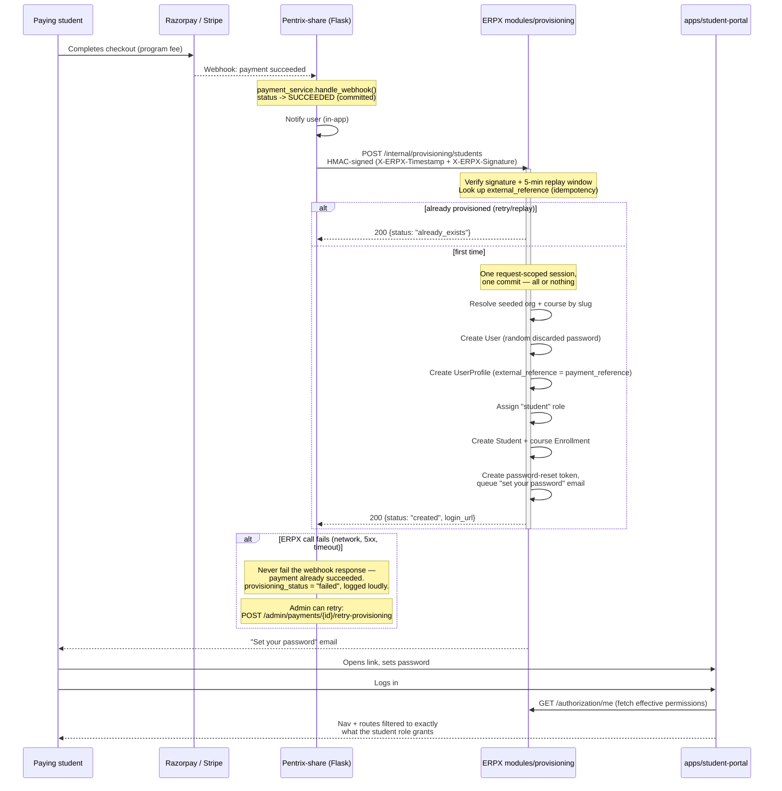

# Pentrix-share → ERPX Student Provisioning

Implementation: `modules/provisioning/` (this repo), `backend/app/services/payment_service.py` + `backend/app/services/erpx_provisioning_client.py` (Pentrix-share repo)
Consumed by: `apps/student-portal` (the account this flow creates logs in there)

## What this is

Pentrix-share is a separate, standalone Flask application (marketing site,
assessment/qualification engine, payments) — deliberately **not merged**
into this monorepo. When a candidate pays the Pentrix program fee there,
this is the one-way integration that turns "payment succeeded" into "a
restricted ERPX account exists, scoped to exactly what a student should
see." Everything downstream of that (courses, LMS, the cyber range) is
ordinary ERPX, gated by the `student` role like any other role.

The two systems never share a database or call each other except through
this one HTTP boundary. ERPX has no idea Pentrix-share exists beyond this
endpoint; Pentrix-share has no idea what's inside ERPX beyond this
endpoint's request/response contract.

## Sequence

## Design decisions worth knowing before touching this

- **Idempotency is on `payment_reference`, not on any Pentrix-share id
  reused elsewhere.** `UserProfile.external_reference` is a nullable,
  unique column (migration `0040`) set to Pentrix's `Payment.id`. A
  webhook replay (providers retry deliveries) or an admin-triggered retry
  after a failure both resolve to the exact same short-circuit path — no
  second user, no second enrollment.

- **Atomicity comes from ERPX's existing request lifecycle, not a new
  transaction wrapper.** `apps/api/app/db/session.py`'s `get_db()`
  dependency hands each request one session, commits once at the end,
  rolls back the whole thing on any exception. `modules/provisioning/service.py`
  only ever `flush()`es between steps — so a failure at any point (e.g. no
  matching course) leaves zero trace: no orphaned `User`, no profile with
  no role. Verified for real in
  `tests/api/test_provisioning_atomicity.py`, not just documented here.

- **Never fails the webhook on an ERPX-side problem.** By the time
  Pentrix-share calls ERPX, the payment itself is already durably
  committed `SUCCEEDED` on Pentrix-share's side — failing that webhook's
  HTTP response over an ERPX outage would only trigger the payment
  provider's retry storm for no benefit. Instead: `Payment.provisioning_status`
  records `pending` → `succeeded`/`failed`, visible on the admin payments
  list and retriable via `POST /admin/payments/<id>/retry-provisioning`.

- **The HMAC scheme is the same construction on both sides, deliberately.**
  `f"{timestamp}.{raw_body}"`, HMAC-SHA256, hex digest — identical to how
  Pentrix-share's own Stripe webhook verification already works
  (`backend/app/payments/stripe_adapter.py`). `ERPX_INTERNAL_SERVICE_SECRET`
  must match exactly between the two `.env` files; a mismatch fails
  closed (401), never silently skips verification.

- **The `student` role's actual permission surface is defined once**, in
  `modules/authorization/service.py`'s `SYSTEM_ROLES` — not re-derived
  here. See that module for the full grant list and the reasoning behind
  each inclusion/exclusion.

## If this later gets collapsed into a full merge

The seam is intentionally exactly this endpoint. Merging the two codebases
would mean: Pentrix-share's payment success handler calls
`ProvisioningService.provision_student()` (or an equivalent in-process
service call) directly instead of over HTTP with HMAC signing — everything
else in this document (the atomicity guarantee, the idempotency key, the
role/enrollment creation, the retry-on-failure story) carries over
unchanged, since none of it actually depends on the two systems being
separate processes.
