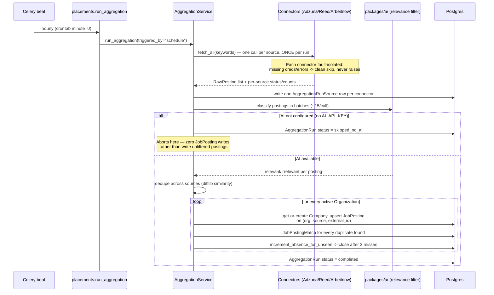

# Placements Job-Board Aggregation

Implementation: `modules/placements/connectors/`, `aggregation_service.py`, `tasks.py` (this repo)
Consumed by: `apps/web` (staff postings list/detail), `apps/student-portal` (student-facing postings card grid)

## What this is

An automated pipeline that populates `JobPosting` with cybersecurity roles
pulled from real, ToS-compliant job-board APIs (Adzuna, Jooble, Reed,
Arbeitnow) — an extension of the existing `modules/placements` module, not a
new one. Every existing student self-service route (`/postings/me`, apply,
withdraw) and staff CRUD route/permission is untouched; the pipeline only
adds new rows to the same `JobPosting` table staff already manage by hand.

## Sequence

Jooble runs on its own **weekly** beat entry (`placements.run_jooble_aggregation`),
not the hourly one — see "Design decisions" below.

## Design decisions worth knowing before touching this

- **Jooble's free tier is a 500-request *lifetime* cap, not a recurring
  quota** (confirmed against Jooble's own help-center docs, not assumed from
  general API-pricing conventions). A literal hourly cadence exhausts it in
  under 3 weeks. Jooble is deliberately scheduled weekly instead, and
  `connectors/jooble.py` additionally enforces a hard lifetime call-budget
  guard (`JOOBLE_LIFETIME_CALL_BUDGET`, default 450) that degrades to a
  clean no-op once spent — never an error. If you need fresher Jooble data,
  shortening its cadence is a conscious tradeoff against how many months of
  the lifetime budget remain, not a free change.

- **Fetching happens once per run, fanned out to every organization
  afterward — never once per organization.** `JobPosting.organization_id`
  is `NOT NULL` and external pulls aren't naturally org-scoped, but calling
  every connector once per organization would multiply request volume by
  organization count, which Adzuna's 250/day and Jooble's 500-lifetime caps
  cannot absorb. This follows the one existing precedent for this shape,
  `modules.accounting.invoices.tasks`, which loops
  `OrganizationRepository.list_all(skip=0, limit=10_000)` filtering
  `org.is_active`.

- **The manual-trigger endpoint (`POST /aggregation/run`) dispatches to
  Celery and returns `202`, unlike the existing `backups`/`reports` "run
  now" routes, which run inline.** Those two are fast and single-scope; a
  full multi-source, multi-organization pull is neither, and per-source
  failure visibility (`AggregationRunSource`) only makes sense with async
  dispatch — a synchronous request can't usefully expose a mid-flight
  per-connector failure. This is the first `.delay()`-based route in the
  codebase; a deliberate, reasoned deviation, not an inconsistency.

- **The AI relevance filter fails closed.** If `AI_API_KEY` isn't
  configured, `AIClient.complete()` raises `ServiceUnavailableError` — the
  whole run aborts with zero `JobPosting` writes and
  `AggregationRun.status = skipped_no_ai`, rather than writing postings
  naive keyword matching alone would let through (e.g. "Airport Security
  Guard" matching on "security"). This is why the relevance filter isn't
  optional/best-effort: writing unfiltered postings to a student-facing
  board is worse than writing nothing this run.

- **Dedup is two-tier: `difflib.SequenceMatcher` first, an AI same-posting
  judgment for the "gray zone."** `packages/ai` has no embedding capability
  (confirmed by reading `packages/ai/client.py` — only `AIClient.complete()`
  exists), so string similarity on `title|company|location` is the
  no-new-dependency option for the confident cases. But pure string
  similarity misses genuinely differently-worded duplicates of the same
  real job — "SOC Analyst I" vs "Security Operations Center Analyst" scores
  ~0.74, "Pentester" vs "Penetration Testing Engineer" scores ~0.75, both
  below a 0.85 auto-match cutoff despite being the same real opening in
  practice (measured directly, not assumed). Pairs scoring between
  `PLACEMENTS_DEDUP_AI_FALLBACK_THRESHOLD` (0.5) and
  `PLACEMENTS_DEDUP_SIMILARITY_THRESHOLD` (0.85) get a batched same-posting
  call to the same AI client the relevance filter uses; pairs below 0.5
  never reach the AI at all, bounding cost. The fallback fails closed
  toward *not* merging (an AI hiccup mid-dedup leaves a gray-zone pair as
  two separate rows, never guesses them into one) — see
  `AggregationService._classify_same_posting_pairs`.

- **Delisted postings are closed, never deleted.** `absence_streak`
  increments each pull a previously-seen non-manual posting isn't re-seen,
  resets on re-sighting, and flips `JobPostingStatus` to `CLOSED` (the
  existing enum value — there's no `EXPIRED`) at 3 consecutive misses.
  History stays queryable through the ordinary staff postings list.

- **Three named niche cybersecurity boards were researched and excluded.**
  CyberSecJobs, InfoSec-Jobs.com, and ClearedJobs.net have no documented
  public API for individual listings — verified directly against each
  site's own docs/pages, not assumed. A related site, infosecjobboard.com,
  does have a free JSON API, but it publishes aggregate counts/benchmarks
  only, not raw postings — unusable here. See
  `modules/placements/connectors/README.md` for the full rationale and how
  to add one back if any of them ever publishes a real listings API.

## If a fifth source is added later

One file under `modules/placements/connectors/` implementing
`fetch_postings(keywords, db) -> ConnectorResult`, one entry in
`connectors/__init__.py`'s `_CONNECTORS` dict, and (if it needs credentials)
one new settings block in `app/core/config.py` + `.env.example` following
the existing pattern. Nothing in `aggregation_service.py`, `tasks.py`, or
the routes needs to change.
